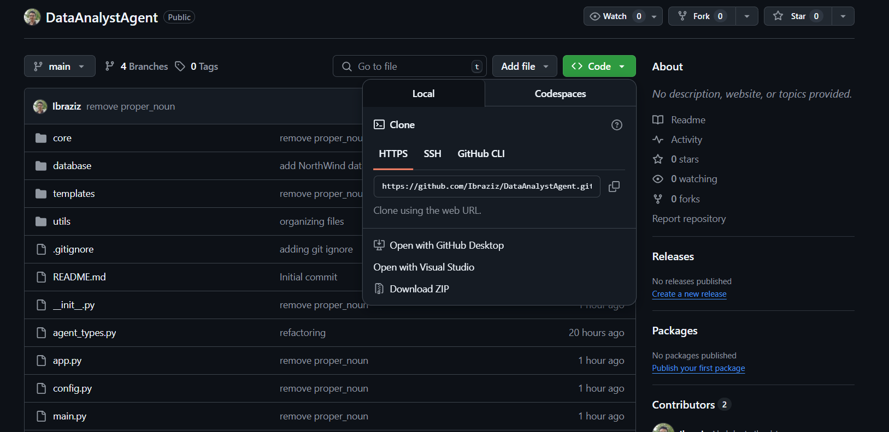
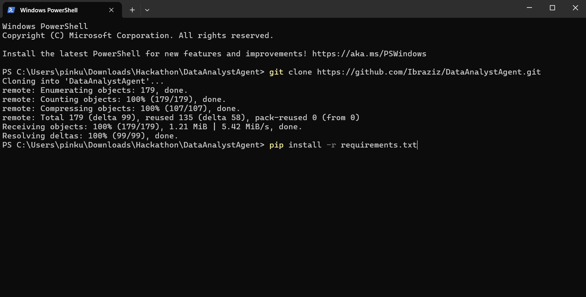
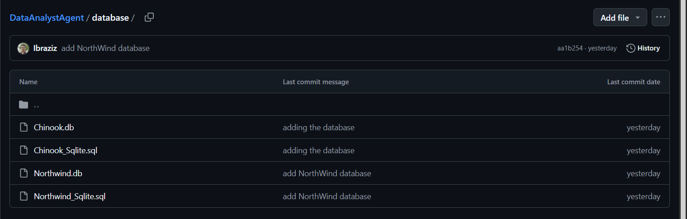
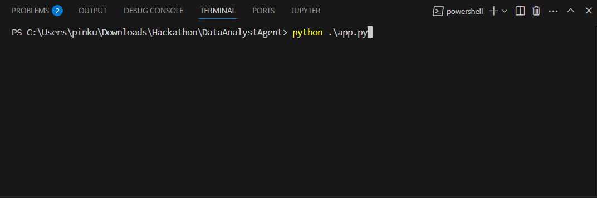
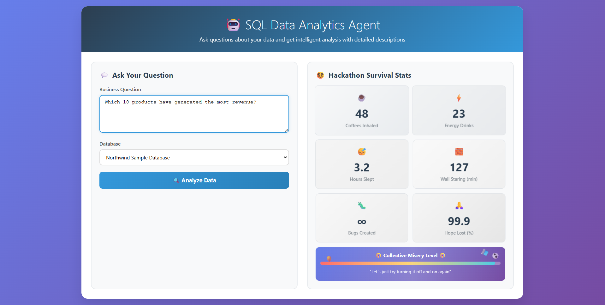
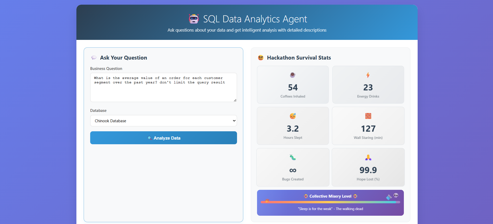
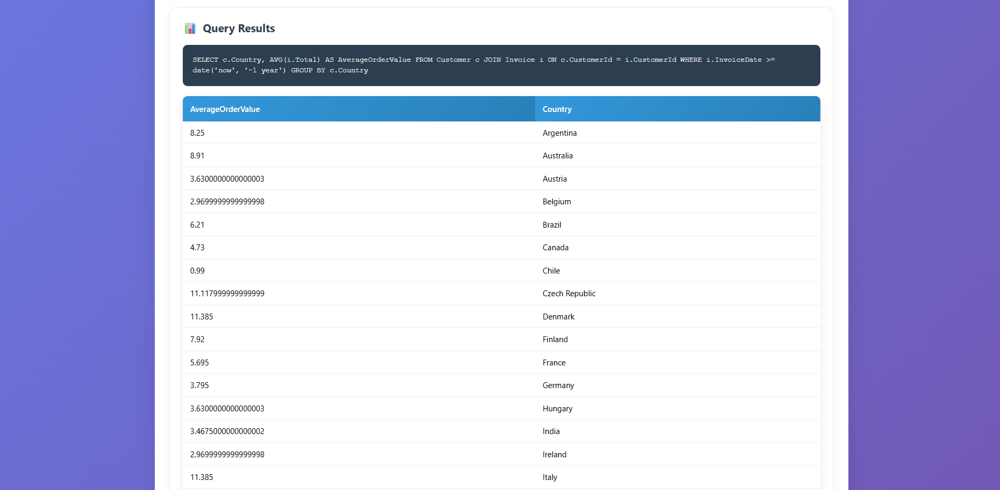
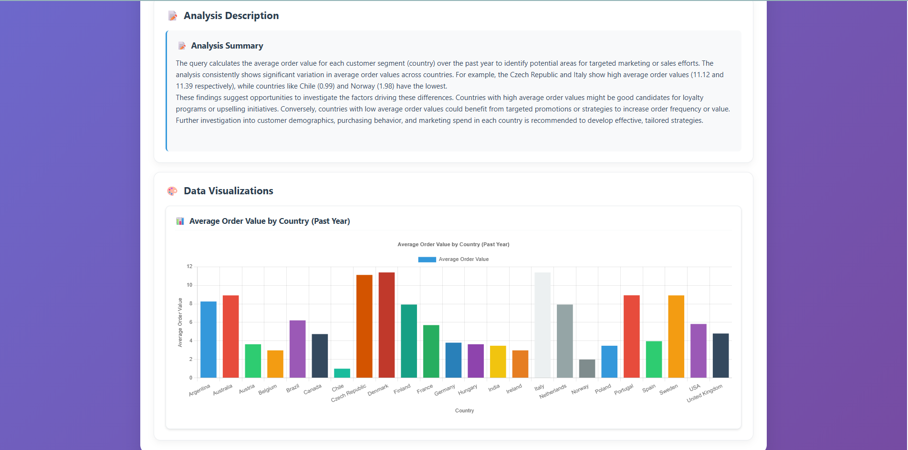
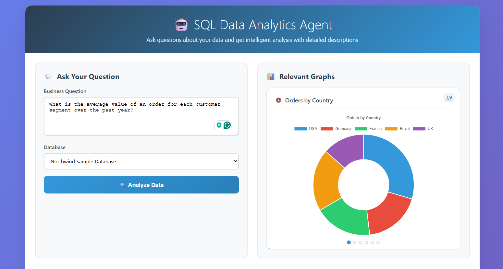
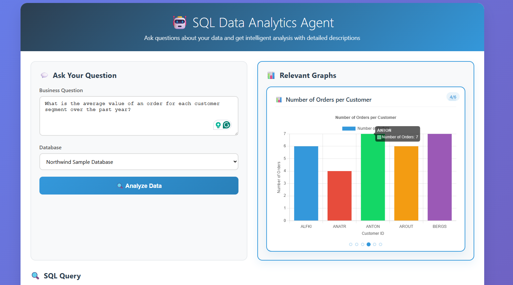

# 🤖 SQL Data Analytics Agent

**DataAnalystAgent** is an autonomous AI agent that leverages the power of Google models to analyze datasets, generate summaries, and answer questions about your data. With a natural language interface, it empowers users to gain insights from a database without writing a single line of code.


## ✨ Features

### 🔍 Core Analytics
- 📊 Upload and analyze your own SQL databases
- 🗣️ Ask natural language questions about your data
- 📝 Generates SQL queries and natural language summaries
- 🧠 **Enhanced AI insights** with contextual analysis and business intelligence
- 📈 **Advanced data visualizations** with Chart.js integration (bar, pie, line, scatter, doughnut, radar, etc.)
- 🔄 **Multi-layered analysis** combining initial insights with enhanced business context

### 🎨 Visualization Engine
- 📊 **Interactive charts** with main and secondary relevancy markers
- 🎯 **Smart chart generation** based on data structure and question context
- 📱 **Responsive design** with modern UI components
- 🎨 **Professional styling** with gradient backgrounds and hover effects
- 📋 **Chart export capabilities** for reports and presentations


### 🔧 Technical Architecture
- ⚙️ Built with LangChain, Google Generative AI, and Flask
- 🧩 **Modular agent architecture** with specialized processors
- 🔄 **Dual insight generation** system for comprehensive analysis
- 📊 **Chart processor** with validation and error handling
- 🎛️ **Configurable recursion limits** and execution controls

### 🌐 Web Interface
- 💻 **Modern Flask web application** with responsive design
- 🎨 **Professional UI** with gradient backgrounds and animations
- 📱 **Mobile-friendly** responsive layout
- 🔄 **Real-time processing** with loading indicators
- 📋 **Question history** and context management

---

## 🚀 Getting Started

### 1. Clone the repository
```bash
git clone https://github.com/yourusername/DataAnalystAgent.git
cd DataAnalystAgent
```


### 2. Install dependencies
```bash
pip install -r requirements.txt
```


### 3. Set up environment
Create a `.env` file with your Google AI API key:
```bash
GOOGLE_API_KEY=your_api_key_here
```


### 4. Prepare your database
- Place your SQLite database file in the `database/` folder
- Example databases: `Chinook_Sqlite.sql`, `Northwind_Sqlite.sql`


### 5. Run the web application
```bash
python app.py
```


### 6. Access the interface
- Open your browser to `http://localhost:5000`
- Start asking questions about your data!


---

## 🗂️ Project Structure

```
DataAnalystAgent/
│
├── core/                      # Core logic for agent orchestration
│   ├── __init__.py           # Core module exports
│   ├── agent.py              # Main DataAnalystAgent class with dual analysis
│   ├── chart_processor.py    # Chart extraction and validation
│   ├── insight_generator.py  # Enhanced insights with business context
│   ├── message_processor.py  # SQL extraction and message handling
│   └── sql_executor.py       # Database query execution
│
├── database/                  # Example and user-uploaded databases
├── static/                    # Static web assets (CSS, JS, images)
├── templates/                 # HTML templates for web interface
│   ├── index.html            # Main application interface
│   └── base.html             # Base template with styling
│
├── utils/                     # Utility functions and helpers
├── __init__.py               # Marks the directory as a Python package
├── agent_types.py            # Defines different agent types and configurations
├── app.py                    # Flask web application entry point
├── config.py                 # Configuration settings (database, dialect, etc.)
├── main.py                   # Command-line entry point for running the agent
├── models.py                 # LLM model configuration and setup
├── prompts.py                # System and tool prompts for the agent
├── requirements.txt          # Python dependencies
├── schemas.py                # Database schema definitions and helpers
├── tools.py                  # Tool definitions (SQL, visualization, etc.)
└── README.md                 # This file
```

---

## 🧑‍💻 Usage Examples

### Basic Query
Ask a question like:
> "What are the top 10 products by revenue?"

### The agent will:
1. 🔍 **Analyze your question** and understand the context
2. 📝 **Generate optimized SQL queries** 
3. ⚡ **Execute queries** against your database
4. 🧠 **Generate dual-layer insights**:
   - Initial comprehensive analysis
   - Enhanced business context and inferences
5. 📊 **Create interactive visualizations** with Chart.js
6. 🎯 **Present results** in a professional web interface
7. 🔄 **Generate follow-up queries** via clickable charts in sliding panel interface








---

## 🎨 New Visualization Features

### Chart Types Supported
- 📊 **Bar Charts** - Perfect for comparisons and rankings
- 🥧 **Pie & Doughnut Charts** - Ideal for proportions and distributions  
- 📈 **Line Charts** - Great for trends and time series
- 🎯 **Scatter Plots** - Excellent for correlations
- 🕸️ **Radar Charts** - Multi-dimensional comparisons
- 📍 **Polar Area Charts** - Alternative proportion displays


### Smart Chart Selection
The AI automatically chooses the most appropriate chart type based on:
- Data structure and relationships
- Question context and intent
- Statistical best practices
- Visual clarity and impact


---

## 🧠 Enhanced Analysis Engine

### Dual-Layer Insights
1. **Initial Analysis**: Comprehensive data interpretation
2. **Enhanced Context**: Business intelligence with industry knowledge


### Context-Aware Processing
- Understands business domains and terminology
- Provides industry-specific insights
- Makes intelligent inferences from data patterns
- Offers actionable recommendations


---

## 🌐 Web Interface Features

### Modern Design
- **Gradient backgrounds** with professional styling
- **Responsive layout** that works on all devices
- **Interactive elements** with hover effects


### User Experience
- **Intuitive question input** with autocomplete suggestions
- **Real-time processing** with progress indicators
- **Result organization** with clear sections
- **Export capabilities** for charts and data


---

## 🛠️ Advanced Customization

### Agent Configuration
- **Recursion limits** for complex query handling
- **Database dialect** support (SQLite, PostgreSQL, MySQL)
- **LLM model selection** and parameters
- **Custom prompt engineering**

```python
# Example configuration
agent = DataAnalystAgent(database_name="northwind")
result = agent.execute_with_results(
    question="Your question here",
    recursion_limit=10,
    generate_summary=True
)
```


### Custom Tools
- **Extend functionality** by adding new tools in `tools.py`
- **Custom chart types** and styling options
- **Additional data sources** and connectors
- **Business logic** integration


### Prompt Customization
- **System prompts** for agent behavior
- **Chart generation** prompts for visualization
- **Insight generation** prompts for analysis style
- **Domain-specific** customizations


---


---

## 📄 License

MIT License. See [LICENSE](LICENSE) for details.

---

## 🤝 Contributing

Pull requests and issues are welcome!

---

## 📬 Contact

For questions or support, open an issue or contact the maintainer.
